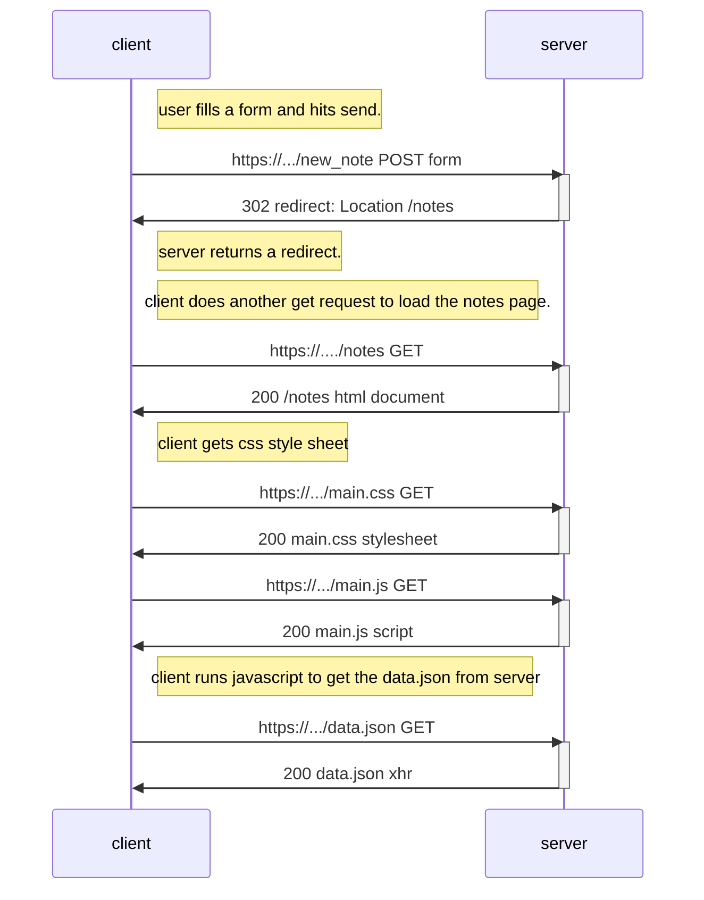

```mermaid
sequenceDiagram
    participant client
    participant server
    note right of client: user fills a form and hits send.
    client->>server: https://.../new_note POST form
    activate server
    server->>client: 302 redirect: Location /notes
    deactivate server
    note right of client: server returns a redirect.
    note right of client: client does another get request to load the notes page.
    client->>server: https://..../notes GET
    activate server
    server->>client: 200 /notes html document
    deactivate server
    note right of client: client gets css style sheet
    client->>server: https://.../main.css GET
    activate server
    server->>client: 200 main.css stylesheet
    deactivate server
    client->>server: https://.../main.js GET
    activate server
    server->>client: 200 main.js script
    deactivate server
    note right of client: client runs javascript to get the data.json from server
    client->>server: https://.../data.json GET
    activate server
    server->>client: 200 data.json xhr
    deactivate server
```
