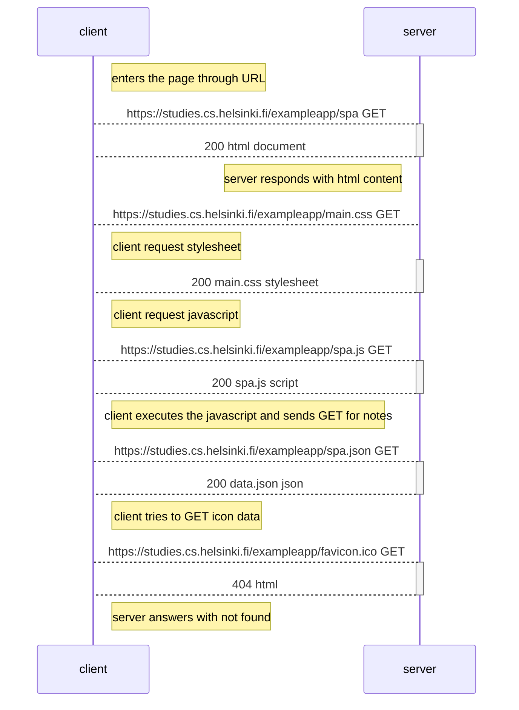

```mermaid
sequenceDiagram
    participant client
    participant server
    note right of client: enters the page through URL
    client-->server: https://studies.cs.helsinki.fi/exampleapp/spa GET
    activate server
    server-->client: 200 html document
    deactivate server
    note left of server: server responds with html content
    client-->server: https://studies.cs.helsinki.fi/exampleapp/main.css GET
    note right of client: client request stylesheet
    activate server
    server-->client: 200 main.css stylesheet
    deactivate server
    note right of client: client request javascript
    client-->server: https://studies.cs.helsinki.fi/exampleapp/spa.js GET
    activate server
    server-->client: 200 spa.js script
    deactivate server
    note right of client: client executes the javascript and sends GET for notes
    client-->server: https://studies.cs.helsinki.fi/exampleapp/spa.json GET
    activate server
    server-->client: 200 data.json json
    deactivate server
    note right of client: client tries to GET icon data
    client-->server: https://studies.cs.helsinki.fi/exampleapp/favicon.ico GET
    activate server
    server-->client: 404 html
    deactivate server
    note right of client: server answers with not found
```
