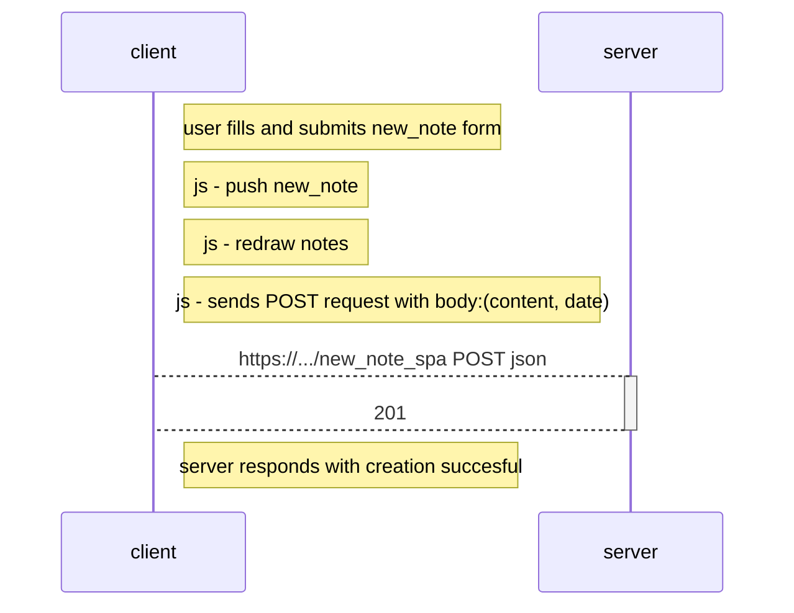

```mermaid
sequenceDiagram
    participant client
    participant server
    note right of client: user fills and submits new_note form
    note right of client: js - push new_note
    note right of client: js - redraw notes
    note right of client: js - sends POST request with body:(content, date)
    client-->server: https://.../new_note_spa POST json
    activate server
    server-->client: 201
    deactivate server
    note right of client: server responds with creation succesful
```
